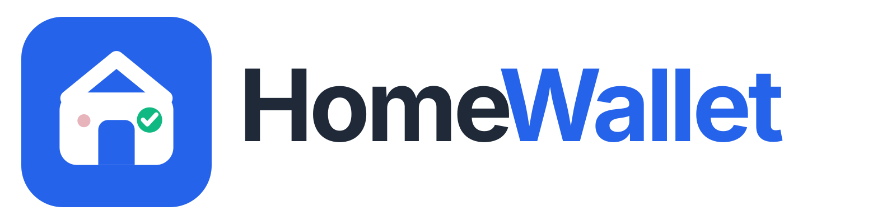
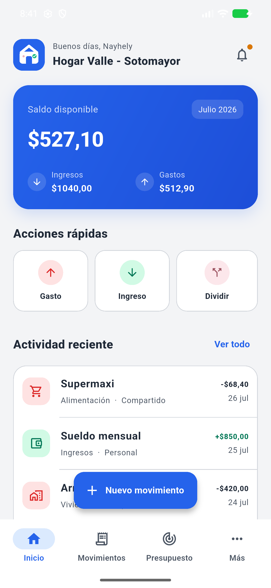
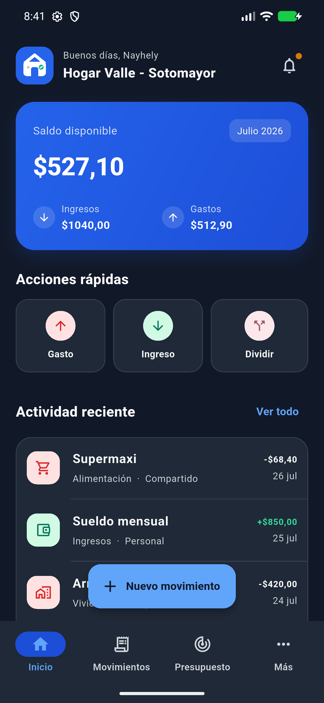

<p align="center">
  
</p>

<h1 align="center">HomeWallet</h1>

<p align="center">
  Finanzas colaborativas, claras y seguras para hogares, parejas y grupos.
</p>

<p align="center">
  
  
  
  
</p>

## Descripción

HomeWallet es una aplicación multiplataforma desarrollada con Flutter para administrar finanzas personales y compartidas. Permite que los integrantes de un hogar registren y consulten movimientos en tiempo real, organicen presupuestos y metas, importen estados de cuenta y mantengan la información financiera cifrada antes de enviarla a Firebase.

<p align="center">
  
  &nbsp;&nbsp;
  
</p>

## Funcionalidades principales

- Registro e inicio de sesión con correo o Google, verificación de correo, recuperación de contraseña y gestión del perfil.
- Sesión persistente protegida con biometría o la credencial segura del dispositivo.
- Creación de hogares para familias, parejas o grupos, con roles y administración de integrantes.
- Invitaciones mediante QR o código manual, con token de un solo uso y vencimiento automático.
- Registro de ingresos, gastos y ahorros, con categorías, filtros y saldos consolidados.
- Presupuestos, metas financieras, movimientos recurrentes y deudas compartidas.
- Importación local de estados de cuenta en CSV, XLS, XLSX y PDF compatible.
- Exportación de reportes profesionales en Excel, PDF y CSV.
- Alertas inteligentes y notificaciones push para la actividad del hogar.
- Tema claro, oscuro o del sistema y una identidad visual adaptada a Android e iOS.

## Seguridad y privacidad

- Cifrado AES-256-GCM en el dispositivo para la información financiera compartida.
- Claves por hogar almacenadas con Android Keystore o iOS Keychain.
- Reglas de Firestore basadas en membresía, rol y correo verificado.
- Invitaciones protegidas con tokens aleatorios de 256 bits, hash SHA-256, expiración y límites de uso.
- Firebase App Check preparado para Play Integrity y App Attest/DeviceCheck.
- Firebase Storage cerrado por defecto mientras no exista un flujo de adjuntos con cifrado de extremo a extremo.
- Procesamiento de archivos bancarios en el dispositivo.

Consulta la [revisión de seguridad](docs/security/security_review.md) y la [matriz de trazabilidad](docs/traceability.md) para conocer el alcance técnico y las validaciones realizadas.

## Tecnologías

| Capa | Tecnologías |
|---|---|
| Aplicación | Flutter 3.29.2, Dart 3.7.2, Material Design |
| Backend | Firebase Authentication, Firestore, Cloud Functions, Storage y Cloud Messaging |
| Observabilidad | Firebase Crashlytics y Analytics |
| Seguridad | App Check, `cryptography`, `flutter_secure_storage` y `local_auth` |
| Funciones | TypeScript, Node.js 22 y Firebase Functions Gen 2 |
| Reportes | Excel, PDF y CSV |

## Requisitos

- Flutter `3.29.2` o una versión estable compatible con Dart `3.7.2`.
- Android Studio y Android SDK para Android; Xcode y CocoaPods para iOS.
- Node.js `22` y npm para Cloud Functions.
- Firebase CLI y FlutterFire CLI para utilizar un proyecto Firebase propio.

Verifica el entorno antes de continuar:

```bash
flutter doctor
node --version
firebase --version
```

## Instalación

1. Clona el repositorio e instala las dependencias de Flutter:

   ```bash
   git clone https://github.com/J-Sotomayor/Home_Wallet.git
   cd Home_Wallet
   flutter pub get
   ```

2. Instala las dependencias de Cloud Functions:

   ```bash
   cd functions
   npm ci
   npm run build
   cd ..
   ```

3. Ejecuta la aplicación en un dispositivo o emulador:

   ```bash
   flutter run
   ```

Para seleccionar un destino concreto, consulta primero los dispositivos disponibles:

```bash
flutter devices
flutter run -d <device-id>
```

## Configuración de Firebase

El código está configurado para el proyecto de producción de HomeWallet. Para desplegar el backend necesitas permisos sobre ese proyecto. Para desarrollo independiente, crea tu propio proyecto Firebase y reemplaza la configuración local:

1. Activa Authentication (correo/contraseña y Google), Firestore, Functions, Storage, Cloud Messaging, Crashlytics, Analytics y App Check.
2. Instala las herramientas si aún no están disponibles:

   ```bash
   npm install --global firebase-tools
   dart pub global activate flutterfire_cli
   firebase login
   ```

3. Asocia el repositorio con tu proyecto y genera la configuración de las plataformas:

   ```bash
   firebase use --add
   flutterfire configure --project=<firebase-project-id>
   ```

4. En Android, registra las huellas SHA-1 y SHA-256 necesarias para Google Sign-In y App Check. En iOS, completa la configuración del URL scheme y de las capacidades requeridas por Firebase.
5. Revisa las reglas y despliega el backend:

   ```bash
   npm --prefix functions run build
   firebase deploy --only firestore:rules,firestore:indexes,storage,functions
   ```

No almacenes archivos de cuentas de servicio, contraseñas, certificados de firma ni variables `.env` en el repositorio.

## Calidad y pruebas

Ejecuta el análisis estático y la suite de Flutter:

```bash
dart format --output=none --set-exit-if-changed .
flutter analyze
flutter test
```

Para validar las reglas de Firestore, inicia los emuladores en una terminal:

```bash
firebase emulators:start --only auth,firestore,functions,storage
```

Y ejecuta la suite de reglas en otra terminal:

```bash
npm --prefix functions run test:rules
```

## Compilación

Android APK para pruebas internas:

```bash
flutter build apk --release
```

Android App Bundle para Google Play:

```bash
flutter build appbundle --release
```

iOS, desde macOS:

```bash
flutter build ios --release
```

> Antes de distribuir la aplicación, sustituye la firma Android de depuración por un keystore de producción, registra las credenciales de release en Firebase/App Check y completa las pruebas en dispositivos físicos.

## Estructura del proyecto

```text
homewallet/
├── android/                 # Proyecto nativo Android
├── assets/                  # Marca, iconos, splash y tipografías
├── docs/                    # Seguridad, trazabilidad y evidencias
├── functions/               # Cloud Functions y pruebas de reglas
├── ios/                     # Proyecto nativo iOS
├── lib/
│   ├── app/                 # Tema, servicios y componentes compartidos
│   ├── core/                # Seguridad, notificaciones y errores
│   └── features/            # Auth, hogares, finanzas, perfil y legal
├── test/                    # Pruebas unitarias y de widgets
└── web/                     # Configuración de Flutter Web
```

## Documentación

- [Informe de implementación](docs/final_implementation_report.md)
- [Trazabilidad funcional](docs/traceability.md)
- [Revisión de seguridad](docs/security/security_review.md)
- [Guía de marca](docs/branding/brand_guidelines.md)
- [Reporte de contraste](docs/branding/color_contrast_report.md)

## Estado del proyecto

La versión actual es `1.0.0+1`. El flujo Android ha sido verificado en emulador; iOS está configurado a nivel de proyecto, pero requiere compilación y validación final en macOS y dispositivos físicos. La publicación en tiendas también requiere firma de producción y la activación controlada de App Check.

## Licencia

Este repositorio no incluye todavía una licencia pública. Todos los derechos permanecen reservados a su autor hasta que se añada un archivo `LICENSE`.
